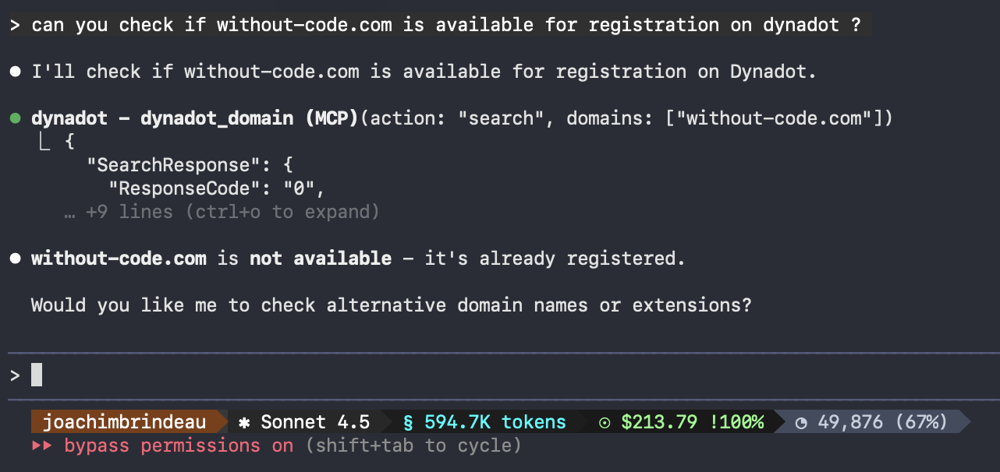
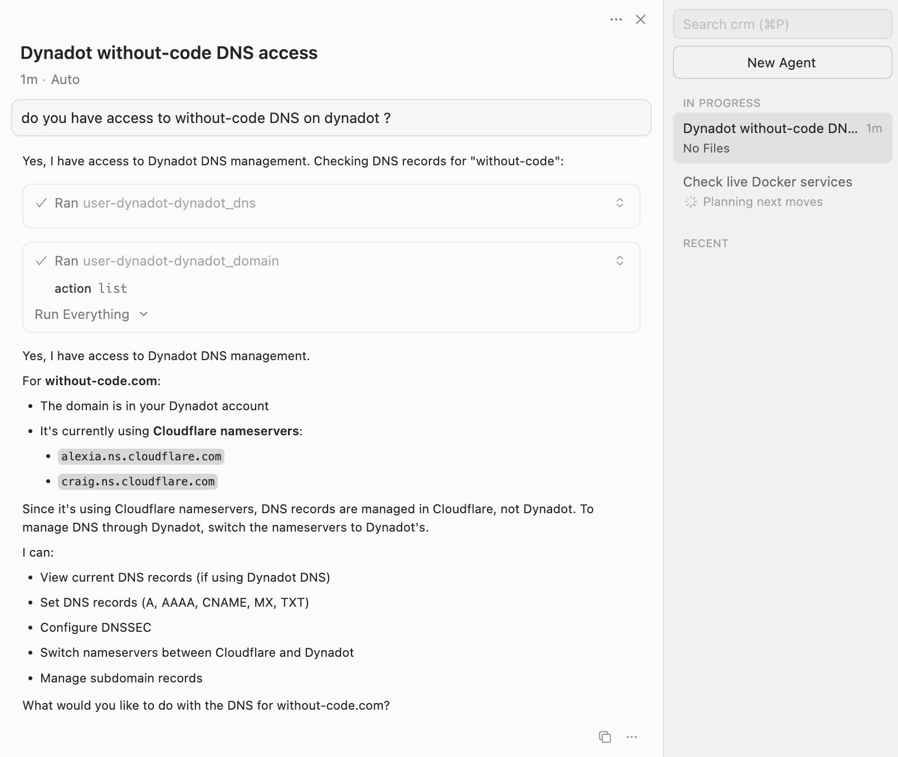

# Domain MCP - Domain Management for AI Assistants

[](https://www.npmjs.com/package/domain-mcp)
[](https://www.npmjs.com/package/domain-mcp)
[](https://opensource.org/licenses/MIT)
[](https://nodejs.org/)
[](https://www.typescriptlang.org/)
[](https://modelcontextprotocol.io/)
[](https://github.com/joachimBrindeau/domain-mcp/actions)
[](https://github.com/prettier/prettier)

A Domain MCP server that brings natural language domain management to Claude, Cursor, and other AI assistants. Manage Dynadot domains, DNS, contacts, and transfers through conversational commands powered by the Model Context Protocol (MCP).

**🚀 AI-powered domain operations - Just ask: "List my domains", "Register example.com", or "Set up DNS"**


---

## Table of Contents

- [Features](#features)
- [Examples in Action](#examples-in-action)
- [Common Use Cases](#common-use-cases)
- [Quick Installation](#quick-installation)
- [Configuration Options](#configuration-options)
- [Usage](#usage)
- [MCP Tools](#mcp-tools-for-domain-management)
- [Development](#development)
- [Testing](#testing)
- [API Quirks & Known Issues](#api-quirks--known-issues)
- [Architecture](#architecture)
- [Documentation](#documentation)
- [FAQ](#frequently-asked-questions)
- [Support](#support)
- [License](#license)

---

## Features

- **🤖 Natural Language Domain Management**: Use AI assistants like Claude and Cursor to manage domains conversationally - no API knowledge needed
- **📦 Complete Domain MCP Server**: 106 Dynadot API actions across 10 composite MCP tools for domains, DNS, transfers, and more
- **⚡ Production-Ready AI Integration**: Built for Claude Code, Cursor, Claude Desktop, and any MCP-compatible client
- **🔒 Type-Safe & Reliable**: TypeScript, Zod validation, comprehensive test suite with 100% tool coverage
- **✅ MCP Protocol Compliant**: Full Model Context Protocol specification compliance with real CRUD operation tests

## Examples in Action

### Claude Code

Check domain availability and get intelligent suggestions:



### Cursor

Manage DNS records with natural language - the AI understands your Dynadot account structure:



### Domain Search with Pricing

Search for available domains and get pricing information instantly:


## Common Use Cases

### For AI-Powered Domain Management

Use this Domain MCP server to manage your Dynadot domains through natural language with AI assistants:

**Domain Operations**
- "Check if example.com is available and show me similar domains"
- "Register example.com and enable WHOIS privacy"
- "Show me all domains expiring in the next 30 days"

**DNS Management**
- "Set up DNS for mysite.com with A record pointing to my server"
- "Add www subdomain and configure MX records for email"
- "Update DNS to point to Cloudflare nameservers"

**Bulk Operations**
- "Enable auto-renewal for all my .com domains"
- "Lock all domains to prevent unauthorized transfers"
- "Search pricing for .com, .net, .io, and .ai domains"

**Advanced Automation**
- "Create a contact and use it to register multiple domains"
- "Transfer example.com from another registrar with auth code"
- "Set up domain forwarding from old-site.com to new-site.com"

**Why Use an MCP Domain Server?**

Traditional domain management requires:
- Memorizing API documentation
- Writing custom scripts
- Manual navigation through control panels

With this Domain MCP integration:
- ✅ **Natural language**: Just describe what you want
- ✅ **AI assistance**: Claude/Cursor understand domain concepts
- ✅ **Context aware**: AI remembers your account structure
- ✅ **Faster workflow**: No context switching to web UI

## Quick Installation

### Prerequisites

You'll need a **Dynadot account** and an **API key** to use this MCP server.

[](https://www.dynadot.com/account/domain/setting/api.html?s9F6L9F7U8Q9U8Z8v)

### Method 1: NPX (Recommended) ⚡

**No installation needed!** NPX runs the package directly from npm.

**Step 1:** Get your API key from [Dynadot Account Settings](https://www.dynadot.com/account/domain/setting/api.html?s9F6L9F7U8Q9U8Z8v)

**Step 2:** Add to your MCP client config:

<details>
<summary><b>Claude Code</b> - Click to expand</summary>

Edit `~/.claude/mcp.json`:

```json
{
  "mcpServers": {
    "domain-mcp": {
      "command": "npx",
      "args": ["-y", "domain-mcp"],
      "env": {
        "DYNADOT_API_KEY": "your-api-key-here"
      }
    }
  }
}
```

Or use the CLI:
```bash
claude mcp add domain-mcp
```

</details>

<details>
<summary><b>Cursor</b> - Click to expand</summary>

Edit `~/.cursor/mcp.json` (macOS/Linux) or `%APPDATA%\Cursor\mcp.json` (Windows):

```json
{
  "mcpServers": {
    "domain-mcp": {
      "command": "npx",
      "args": ["-y", "domain-mcp"],
      "env": {
        "DYNADOT_API_KEY": "your-api-key-here"
      }
    }
  }
}
```

Restart Cursor after editing.

</details>

<details>
<summary><b>Claude Desktop</b> - Click to expand</summary>

Edit the config file:
- **macOS**: `~/Library/Application Support/Claude/claude_desktop_config.json`
- **Windows**: `%APPDATA%\Claude\claude_desktop_config.json`
- **Linux**: `~/.config/Claude/claude_desktop_config.json`

```json
{
  "mcpServers": {
    "domain-mcp": {
      "command": "npx",
      "args": ["-y", "domain-mcp"],
      "env": {
        "DYNADOT_API_KEY": "your-api-key-here"
      }
    }
  }
}
```

Restart Claude Desktop after editing.

</details>

**Step 3:** Restart your AI assistant and start using domain commands!

### Method 2: Global Install

Install globally with npm:

```bash
npm install -g domain-mcp
```

Then use `domain-mcp` instead of `npx -y domain-mcp` in your config:

```json
{
  "mcpServers": {
    "domain-mcp": {
      "command": "domain-mcp",
      "env": {
        "DYNADOT_API_KEY": "your-api-key-here"
      }
    }
  }
}
```

### Method 3: Local Development

For contributing or customization:

```bash
git clone https://github.com/joachimBrindeau/domain-mcp.git
cd domain-mcp
npm install
npm run build
```

Then configure with absolute path:

```json
{
  "mcpServers": {
    "domain-mcp": {
      "command": "node",
      "args": ["/absolute/path/to/domain-mcp/dist/index.js"],
      "env": {
        "DYNADOT_API_KEY": "your-api-key-here"
      }
    }
  }
}
```

## Configuration Options

### Required
- `DYNADOT_API_KEY` - Your Dynadot API key ([Get it here](https://www.dynadot.com/account/domain/setting/api.html?s9F6L9F7U8Q9U8Z8v))

### Optional
- `DYNADOT_SANDBOX` - Set to `"true"` for sandbox testing (default: `"false"`)

**📖 Full Documentation**:
- [Setup Guide](./docs/setup.md) - Detailed setup with troubleshooting
- [Environment Variables](./docs/environment.md) - Complete environment variable reference
- [Sandbox Limitations](./docs/sandbox.md) - Known sandbox API limitations

## Usage

### As MCP Server

Once configured, you have access to 10 powerful tools

### Programmatic Usage

```typescript
import { getClient } from './src/client.js';

const client = getClient();

// Search domains
const result = await client.execute('search', {
  domains: ['example.com', 'example.net'],
  showPrice: true,
  currency: 'USD'
});

// Get domain info
const info = await client.execute('domain_info', {
  domain: 'example.com'
});

// Manage DNS
await client.execute('set_dns2', {
  domain: 'example.com',
  mainRecords: [
    { type: 'A', value: '192.0.2.1', ttl: 3600 }
  ]
});
```

## MCP Tools for Domain Management

This Domain MCP server provides 10 comprehensive tools for AI-powered domain operations:

### 1. dynadot_domain - Core Domain Operations
List, search, register, renew, delete, info, lock, and pricing operations for your domains.

**Common AI commands**: "List my domains", "Search for example.com", "Register domain", "Check .com pricing"

### 2. dynadot_domain_settings - Domain Configuration
Configure domain settings: nameservers, privacy, renewal, forwarding, parking, WHOIS.

**Common AI commands**: "Enable WHOIS privacy", "Set nameservers", "Configure domain forwarding", "Enable auto-renewal"

### 3. dynadot_dns - DNS Management
DNS management: get/set DNS records, DNSSEC configuration.

**Common AI commands**: "Show DNS records", "Add A record", "Configure MX records", "Enable DNSSEC"

### 4. dynadot_nameserver - Nameserver Management
Manage registered nameservers (glue records): register, update IP, delete, list.

**Common AI commands**: "Register nameserver", "Update nameserver IP", "List my nameservers"

### 5. dynadot_transfer - Domain Transfers
Domain transfers: initiate, check status, manage auth codes, push requests.

**Common AI commands**: "Transfer domain to Dynadot", "Get auth code", "Check transfer status", "Push domain to another account"

### 6. dynadot_contact - WHOIS Contact Management
WHOIS contact management: create, edit, delete, list, regional settings.

**Common AI commands**: "Create new contact", "List contacts", "Update contact info", "Delete contact"

### 7. dynadot_folder - Folder Management
Folder management: create, delete, list, configure folder-level settings.

**Common AI commands**: "Create domain folder", "List folders", "Move domain to folder", "Configure folder settings"

### 8. dynadot_account - Account Settings
Account info, balance, and default settings for new domains.

**Common AI commands**: "Check account balance", "Show account info", "Set default nameservers", "Configure default WHOIS"

### 9. dynadot_aftermarket - Aftermarket Operations
Aftermarket: auctions, backorders, expired domains, marketplace listings.

**Common AI commands**: "List domain auctions", "Place bid on auction", "Backorder expired domain", "List my marketplace domains"

### 10. dynadot_order - Order Management
Orders, coupons, processing status, reseller operations.

**Common AI commands**: "Check order status", "List available coupons", "View order history"

## Development

### Build

```bash
npm run build
```

### Run Tests

```bash
# Default test run (integration tests are skipped unless explicitly enabled)
npm test

# Integration tests (requires network access + Dynadot credentials)
RUN_INTEGRATION_TESTS=true DYNADOT_API_KEY=your-api-key TEST_DOMAIN=your-domain.com npm test

# E2E tests (validates all 106 API endpoints)
RUN_INTEGRATION_TESTS=true TEST_DOMAIN=your-domain.com npm test -- test/e2e.test.ts

# Functional tests (real CRUD operations)
RUN_INTEGRATION_TESTS=true TEST_DOMAIN=your-domain.com npm test -- test/functional.test.ts

# Watch mode
npm run test:watch
```

### Development Mode

```bash
npm run dev
```

## Testing

### E2E Tests
Validates that all 106 API actions are properly mapped and return valid responses.

### Functional Tests
Tests real CRUD operations:
- Folder CRUD (create, list, rename, delete, verify)
- Contact CRUD (create, list, get, edit, delete, verify)
- Domain Note (set, verify, clear)
- Domain Lock/Unlock
- Renewal Options

**Test Coverage**: 26/26 functional tests passing

## API Quirks & Known Issues

### edit_contact
Dynadot API requires ALL contact fields to be provided when editing, not just the fields you want to change. Partial updates will fail with "missing email" or similar errors.

**Solution**: Always provide complete contact data:
```typescript
await client.execute('edit_contact', {
  contact_id: '12345',
  name: 'Updated Name',
  email: 'email@example.com',
  phonecc: '1',
  phonenum: '5551234567',
  address1: '123 Street',
  city: 'City',
  state: 'CA',
  zip: '94102',
  country: 'US'
});
```

### lock_domain unlock
The `lock_domain` unlock command may return a misleading error "this domain has been locked already" when attempting to unlock. This appears to be either:
- Domain protection preventing API unlock
- A bug in the Dynadot API error messaging

Unlocking domains may need to be done through the Dynadot control panel.

## Architecture

```
src/
├── index.ts       # MCP server entry point
├── client.ts      # Dynadot API client
├── schema.ts      # Tool and action definitions (10 tools, 106 actions)
└── register.ts    # Tool registration with MCP server

test/
├── e2e.test.ts         # Endpoint validation tests
└── functional.test.ts  # Real CRUD operation tests
```

## Dependencies

- `@modelcontextprotocol/sdk` - MCP protocol implementation
- `ky` - HTTP client for API requests
- `zod` - Schema validation
- `vitest` - Testing framework
- `typescript` - Type safety

## Documentation

### 📚 Guides
- **[Quick Start](#quick-installation)** - Get up and running in 5 minutes
- **[Setup Guide](docs/setup.md)** - Detailed setup for Claude Code, Cursor, Claude Desktop
- **[Deployment](docs/deployment.md)** - Local, Docker, remote, and serverless options
- **[Environment](docs/environment.md)** - Complete environment variable reference
- **[Testing](docs/testing.md)** - Automated testing with Claude Haiku
- **[Reference](docs/reference.md)** - Common commands and usage patterns
- **[Examples](examples/)** - Code examples for common operations

### 🔧 Development
- **[Contributing](CONTRIBUTING.md)** - How to contribute, API quirks, testing
- **[Changelog](CHANGELOG.md)** - Version history and updates
- **[Roadmap](docs/roadmap.md)** - Implementation status and roadmap

### 🏗️ Project
- **[License](LICENSE)** - MIT License

## License

MIT

## Contributing

1. Fork the repository
2. Create a feature branch
3. Make your changes
4. Add tests for new functionality
5. Ensure all tests pass
6. Submit a pull request

## Frequently Asked Questions

### What is an MCP server for domains?

A Domain MCP server is a Model Context Protocol server that enables AI assistants like Claude and Cursor to manage domains through natural language. Instead of using a web interface or writing API code, you simply ask your AI assistant to perform domain operations.

### How is this different from using the Dynadot website?

The Domain MCP server brings domain management into your AI assistant's context:
- **Natural language**: "Register example.com" vs clicking through multiple pages
- **AI understanding**: The assistant knows your account structure and suggests related actions
- **Workflow integration**: Manage domains while coding, writing, or working without leaving your editor
- **Automation ready**: Chain multiple domain operations in one conversation

### Which AI assistants work with this Domain MCP server?

This MCP server works with any MCP-compatible AI assistant:
- **Claude Code** - Anthropic's official CLI
- **Cursor** - AI-powered code editor
- **Claude Desktop** - Anthropic's desktop app
- Any other client supporting the Model Context Protocol

### Do I need to know the Dynadot API?

No! That's the power of the Domain MCP approach. Your AI assistant handles the API complexity. Just describe what you want in natural language.

### Is this safe to use with production domains?

Yes, with proper precautions:
- **Sandbox mode**: Test with `DYNADOT_SANDBOX=true` first
- **Review actions**: The AI shows you what it will do before executing
- **API limits**: Dynadot's API rate limits prevent runaway operations
- **Audit trail**: All operations are logged in your Dynadot account

### How much does it cost?

The Domain MCP server itself is **free and open source** (MIT license). You only pay for Dynadot domain services and your AI assistant subscription.

## Support

### Getting Help with Domain MCP

- **Issues & Questions**: [GitHub Issues](https://github.com/joachimBrindeau/domain-mcp/issues)
- **Feature Requests**: [GitHub Discussions](https://github.com/joachimBrindeau/domain-mcp/discussions)
- **Contributing**: See [CONTRIBUTING.md](CONTRIBUTING.md)

### Documentation Resources

**Dynadot API**:
- [API Commands](https://www.dynadot.com/domain/api-commands?s9F6L9F7U8Q9U8Z8v) - Complete API reference
- [API Help](https://www.dynadot.com/community/help/api?s9F6L9F7U8Q9U8Z8v) - Community support

**Model Context Protocol**:
- [MCP Specification](https://modelcontextprotocol.io/) - Official MCP documentation
- [MCP Servers](https://github.com/modelcontextprotocol/servers) - Example MCP implementations
